## Latihan MySQL 

Nama: Alifia Ananda Putri

Nim: 312210168

Kelas: TI.22.A2

Mapel: Basis Data

## Tugas Praktikum

1. Buat sebuah database dengan nama latihan2!

2. Buat sebuah tabel dengan nama biodata (nama, alamat) didalam database latihan1!

3. Tambahkan sebuah kolom keterangan (varchar 15), sebagai kolom terakhir!

4. Tambahkan kolom id (int 11) di awal (sebagai kolom pertama)!

5. Sisipkan sebuah kolom dengan nama phone (varchar 15) setelah kolom alamat!

6. Ubah tipe data kolom id menjadi char(11)!

7. Ubah nama kolom phone menjadi hp (varchar 20)!

8. Tambahkan kolom email setelah kolom hp

9. Hapus kolom keterangan dari tabel!

10. Ganti nama tabel menjadi data_mahasiswa!

11. Ganti nama field id menjadi nim!

12. Jadikan nim sebagai PRIMARY KEY!

13. Jadikan kolom email sebagai UNIQUE KEY

Sebelum memulai praktikum alangkah sudah menginstall XAMPP terlebih dahulu, Bisa di download melalui situs:

> Membuat DATABASE dan untuk masuk kedalam DATABASE nya menggunakan perintah sebagai berikut:

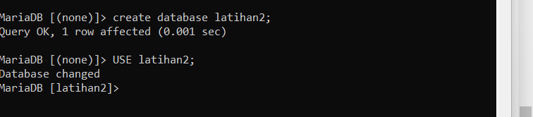

> Membuat tabel Sebelum membuat Tabel, pastikan database aktif yang digunakan dengan terlebih dahulu masuk kedalam databasenya, dengan perintah USE. dalam membuat tabel menggunakan perintah berikut :

CREATE TABLE nama_tabel (nama_field1 tipe _data(ukuran), nama_field2 tipe_data(ukuran), ..., nama_fieldn tipe_data(ukuran));

Berikut perintah yang saya gunakan :

CREATE TABLE biodata (nama VACHAR (15), alamat TEXT);

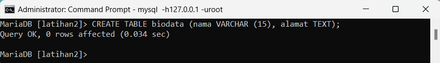

> Untuk menampilkan struktur tabel yang sudah dibuat, gunakan perintah:

DESCRIBE [nama_tabel];

atau

DESC [nama_tabel]

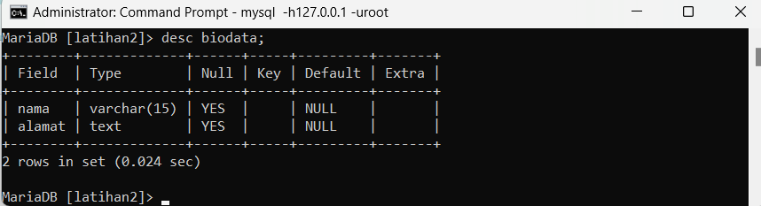

> Untuk menambahkan field, gunakan perintah:

ALTER TABLE [nama_tabel] ADD COLUMN nama_field tipe_data(ukuran) [AFTER|BEFORE|FIRST]

nah perintah praktikum yaitu menambahkan sebuah kolom keterangan (varchar 15), sebagai kolom terakhir.

maka saya menggunakan :

ALTER TABLE biodata ADD COLUMN keterangan VARCHAR (15) AFTER alamat;

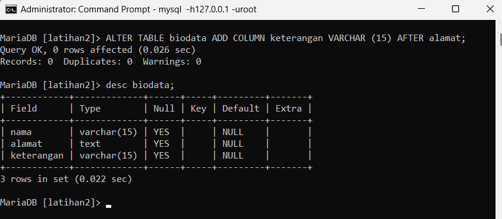

> Menambahkan kolom id (int 11) di awal (sebagai kolom pertama) dapat menggunakan perintah berikut:

ALTER TABLE biodata ADD COLUMN id int (11) FIRST;

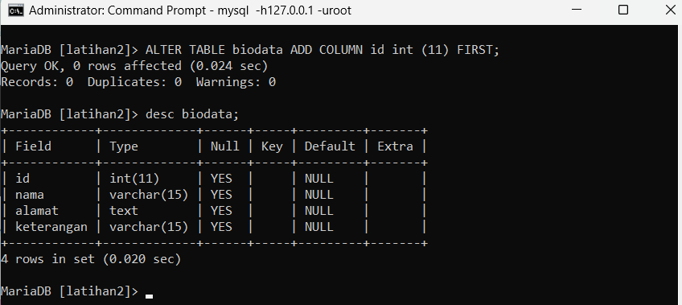

> Untuk menyisipkan sebuah kolom dengan nama phone (varchar 15) setelah kolom alamat dapat menggunakan perintah berikut:

ALTER TABLE biodata ADD COLUMN phone VARCHAR (15) AFTER alamat;

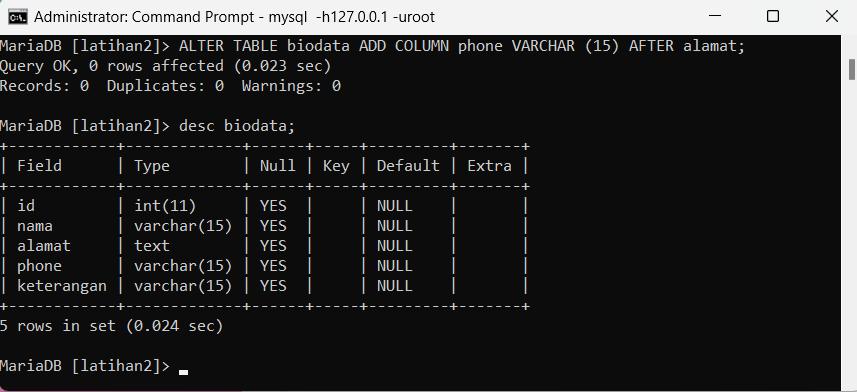

> Untuk mengubah tipe data menggunakan perintah berikut

ALTER TABLE [nama_tabel] MODIFY nama_field tipe_data_baru(ukuran);

di sini saya akan mengubah tipe data kolom id menjadi char(11):

ALTER TABLE biodata MODIFY id char(11);

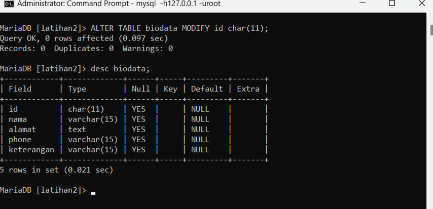

> untuk mengubah nama kolom phone menjadi hp (varchar 20) dapat menggunakan perintah berikut :

ALTER TABLE [nama_tabel] CHANGE nama_field_lama nama_field_baru tipe_data(ukuran);

ALTER TABLE biodata CHANGE phone hp varchar(20);

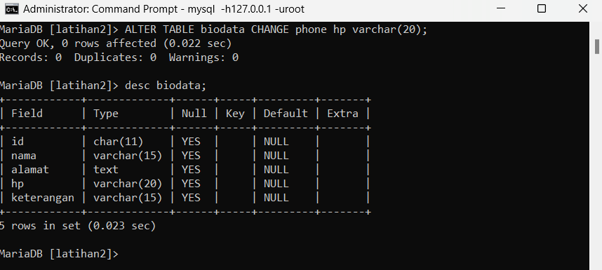

> Untuk menabahkan kolom email setelah kolom hp bisa menggunakan perintah berikut :

ALTER TABLE biodata ADD COLUMN email VARCHAR (10) AFTER hp;

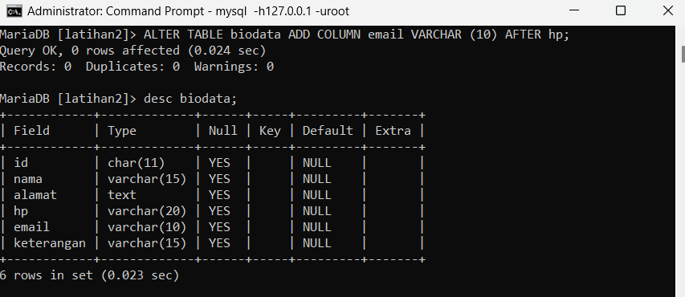

> Untuk menghapus field, gunakan perintah:

ALTER TABLE [nama_tabel] DROP nama_field;

di sini saya akan menghapus kolom keterangan dari tabel,

ALTER TABLE biodata DROP keterangan;

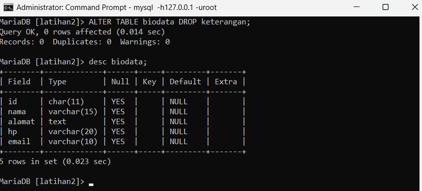

> Untuk mengubah nama tabel, gunakan perintah:
ALTER TABLE [nama_tabel] RENAME [nama_tabel_baru]

di sini saya akan mengganti nama tabel menjadi data_mahasiswa,

ALTER TABLE biodata RENAME data_mahasiswa;

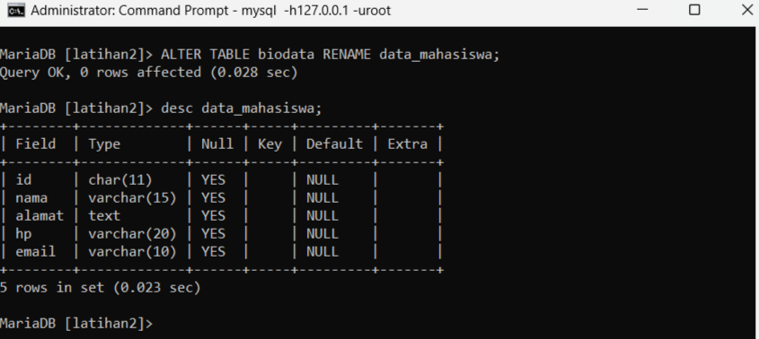

> selanjutnya saya akan mengganti nama field id menjadi nim,

ALTER TABLE data_mahasiswa CHANGE id NIM char(11);

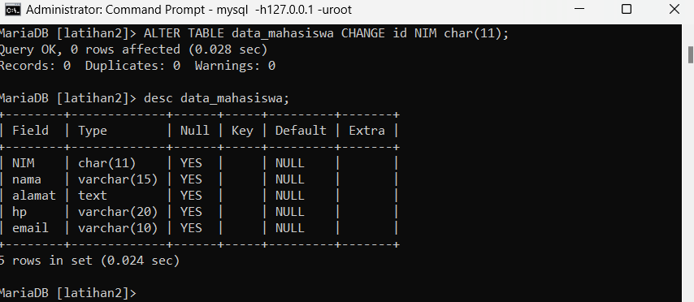

> Untuk menambah Index, gunakan perintah:

ALTER TABLE [nama_tabel] ADD [INDEX|PRIMARY KEY] (nama_field);

• Atau bisa juga menggunakan perintah :

CREATE INDEX nama_index ON nama_tabel (nama_field);

di sini saya akan menjadikan nim sebagai PRIMARY KEY,

ALTER TABLE data_mahasiswa ADD PRIMARY KEY (NIM);

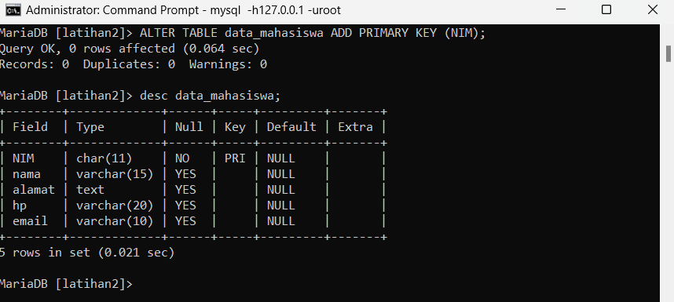

> Menjadikan email sebagai unique key dapat menggunakan perintah berikut:

ALTER TABLE data_mahasiswa ADD UNIQUE KEY (email);

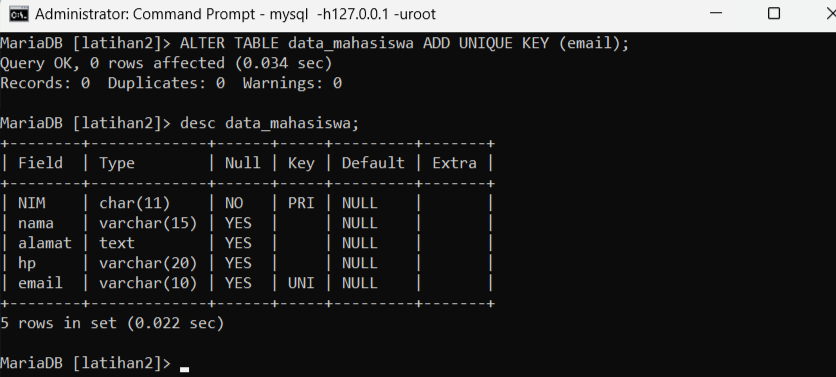

## Evaluasi dan Pertanyaan

Tulis semua perintah-perintah SQL percobaan diatas beserta outputnya!

1. Membuat Database

CREATE DATABASE latihan1;

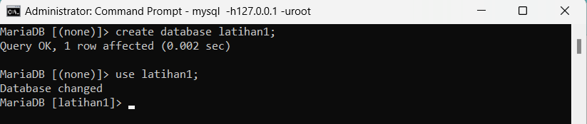

2. Membuat TABLE

CREATE TABLE siswa (nama VARCHAR(100), alamat TEXT);

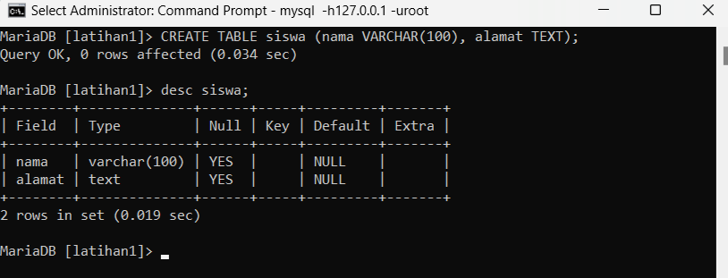

3. Menambahkan Kolom

ALTER TABLE siswa ADD COLUMN ketengan TEXT AFTER alamat;

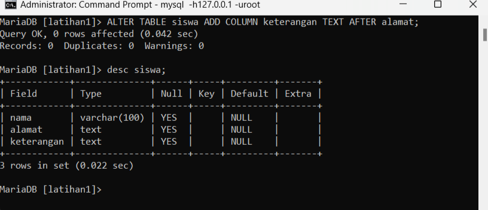

4. Menambah kolom diawal

ALTER TABLE siswa ADD COLUMN id INT FIRST;

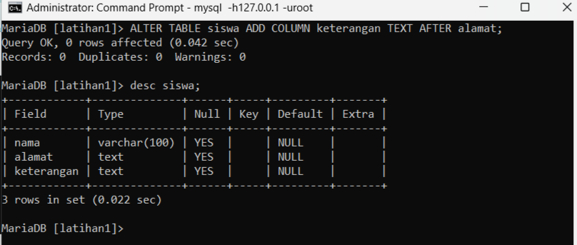

5. Mengubah nama kolom

ALTER TABLE siswa CHANGE COLUMN keterangan kelas TEXT;

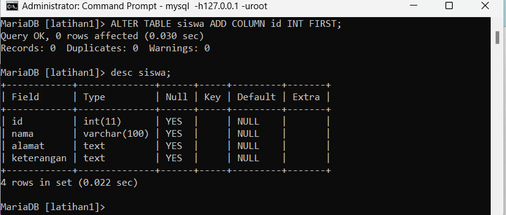

6. Mengubah tipe data

ALTER TABLE siswa MODIFY COLUMN kelas VARCHAR(10);

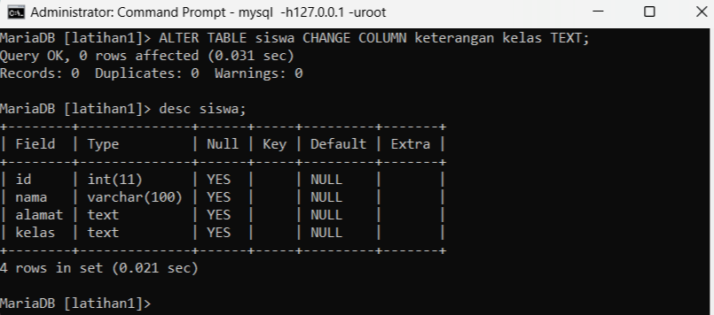

7. Menghapus kolom

ALTER TABLE siswa DROP COLUMN kelas;

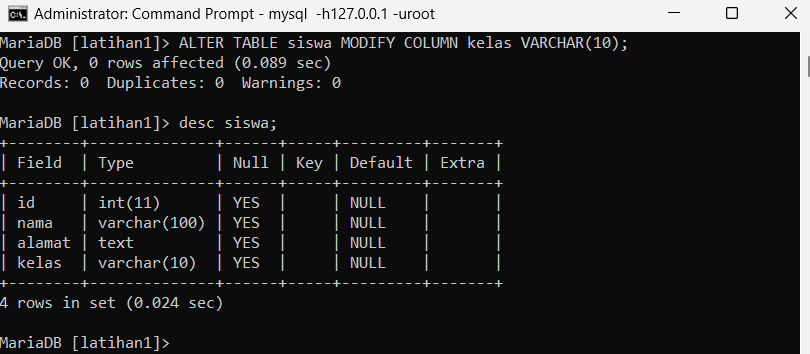

8. Menambah PRIMARY KEY

ALTER TABLE siswa ADD PRIMARY KEY(id);

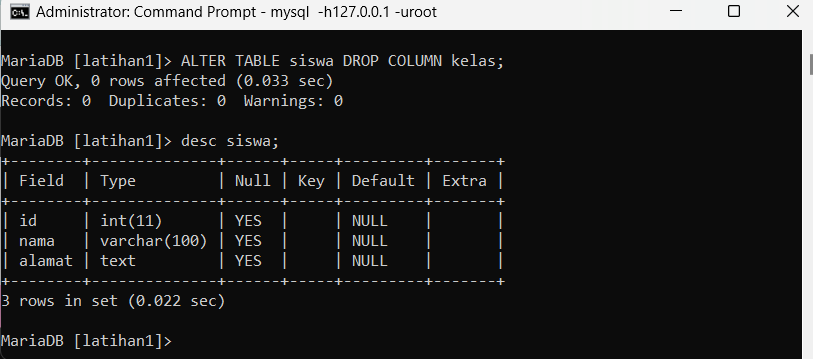

9. Menambah CONSTRAINT

ALTER TABLE siswa ADD CONSTRAINT uk_sisiwa PRIMARY KEY(id);

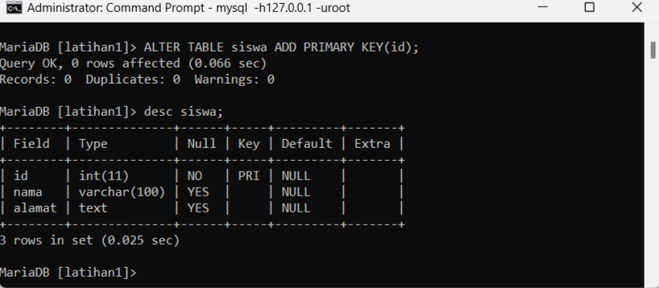

karena primary key telah digunakan dalam id maka kita bisa menggunakan uniqe key sebagai gantinya agar menghindari multiple primary key.

10. Menghapus PRIMARY KEY

ALTER TABLE siswa DROP PRIMARY KEY;

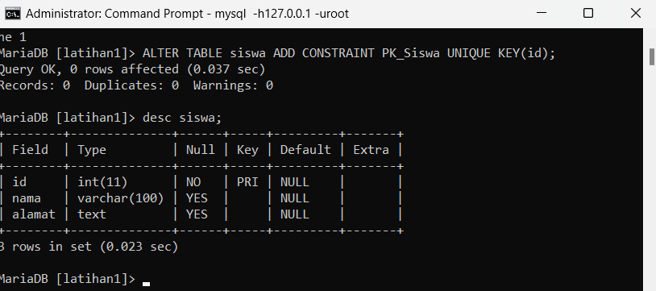

11. Menghapus CONSTRAINT

ALTER TABLE siswa DROP CONSTRAINT pk_siswa;

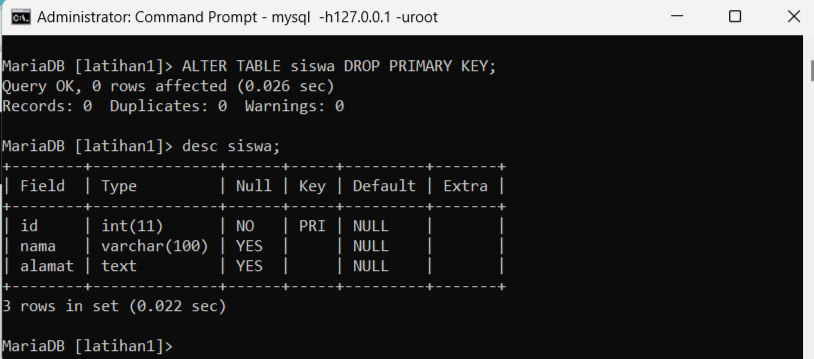

